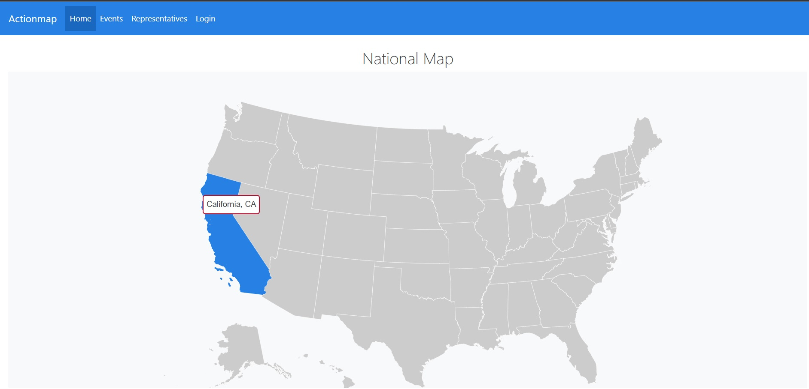
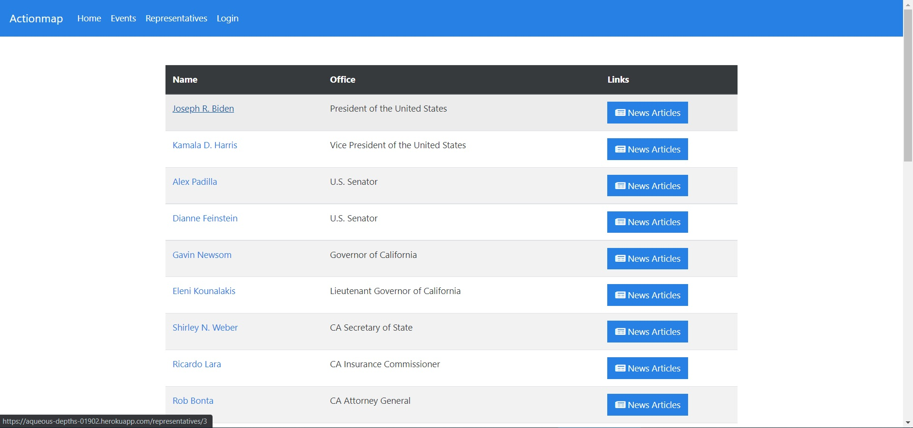
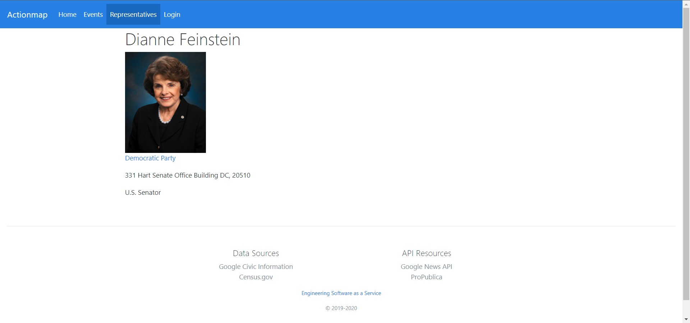
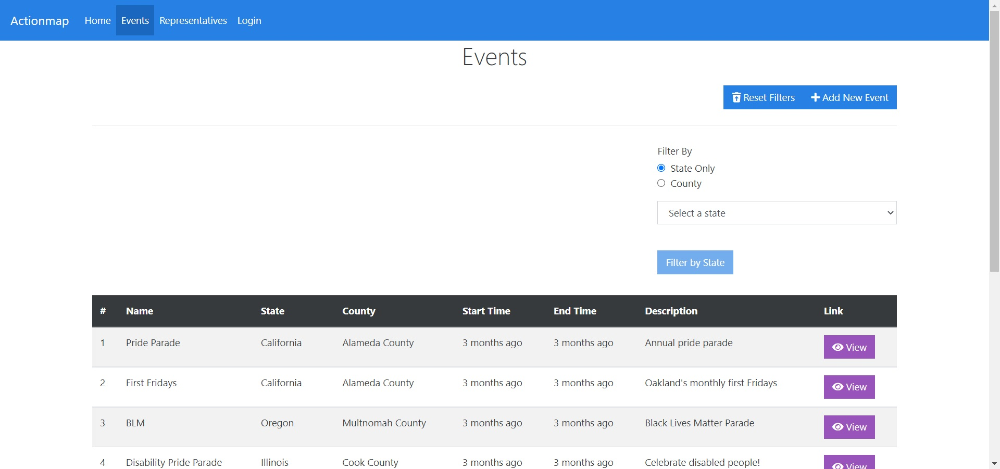

## Actionmap: Agile Iterations of SaaS project page

**Project description:** Given [existing software](https://github.com/cs169/hw-agile-iterations), my group and I were tasked with familiarizing ourselves with the codebase, fixing existing bugs, and adding new features to the app. Through this process, we used user stories, git branching, and agile iterations in order to have a website that could be live for the duration of the project.

---

### Improvements
We were tasked with bug fixes in various parts of the codebase that allowed users to interact with the map and reliably see the representatives serving that part of the map, and bugs that prevented relevant events from being posted by users. Our group was also tasked with adding Google API support so that the app would convey important information about the political representatives serving an area without relying on user uploaded content, and we added functionality for logging on via third party authenticators, such as Google and GitHub. The representatives pages were also given an entry system for uploading relevant news articles and rating the politicians.
### Screenshots

{: width="1000px" }

{: width="1000px" }

{: width="1000" }

{: width="1000" }

